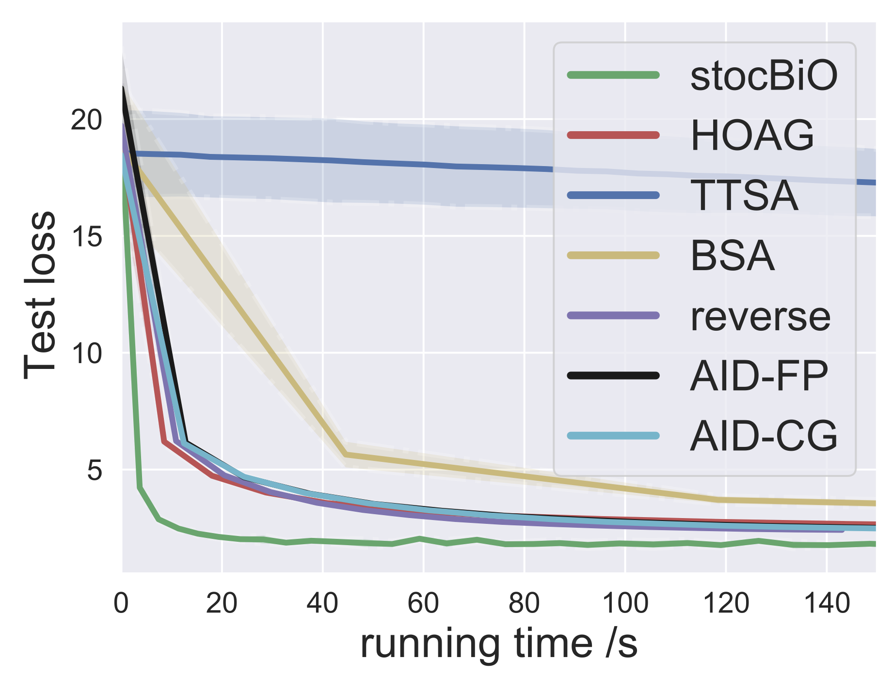

# Bilevel Optimizers stocBiO, ITD-BiO and FO-ITD-BiO for hyperparameter optimization and meta-learning
Codes for paper [Bilevel Optimization: Nonasymptotic Analysis and Faster Algorithms](https://arxiv.org/pdf/2010.07962.pdf).

## stocBiO for hyperparameter optimization
Our hyperparameter optimization implementation is bulit on [HyperTorch](https://github.com/prolearner/hypertorch), where we propose stoc-BiO algorithm with better performance than other bilevel algorithms.

The implementation of stoc-BiO is located in two experiments [l2reg_on_twentynews.py](https://github.com/JunjieYang97/StocBio_hp/tree/master/experimental/l2reg_on_twentynews.py) and [mnist_exp.py](https://github.com/JunjieYang97/StocBio_hp/tree/master/experimental/mnist_exp.py). We will implement our stoc-BiO as a class for an independent use soon!  

## ITD-BiO and FO-ITD-BiO for meta-learning
Our meta-learning part is built on [learn2learn](https://github.com/learnables/learn2learn), where we implement the bilevel optimizer ITD-BiO and show that it converges faster than MAML and ANIL. Note that we also implement first-order ITD-BiO (FO-ITD-BiO) without computing the derivative of the inner-loop output with respect to feature parameters, i.e., removing all Jacobian and Hessian-vector calculations. It turns out that FO-ITD-BiO is even faster without sacrificing overall prediction accuracy.  

## Some experiment examples

In the following, we provide some experiments to demonstrate the better performance of the proposed stoc-BiO algorithm. 

We compare our algorithm to various hyperparameter baseline algorithms on newspaper dataset:

We evaluate the performance of our algorithm with respect to different batch sizes:

The comparison results on MNIST dataset:

This repo is still under construction and any comment is welcome! 
