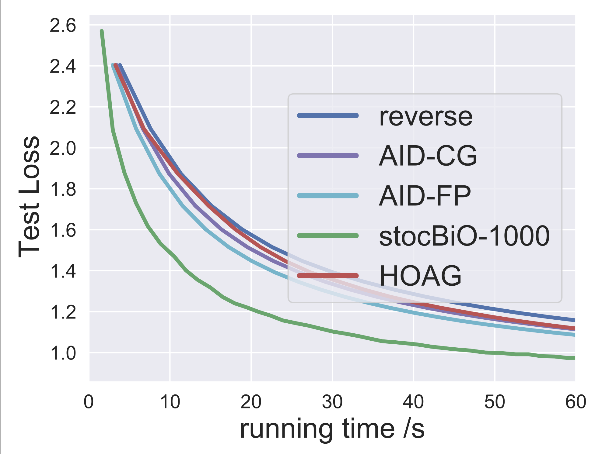
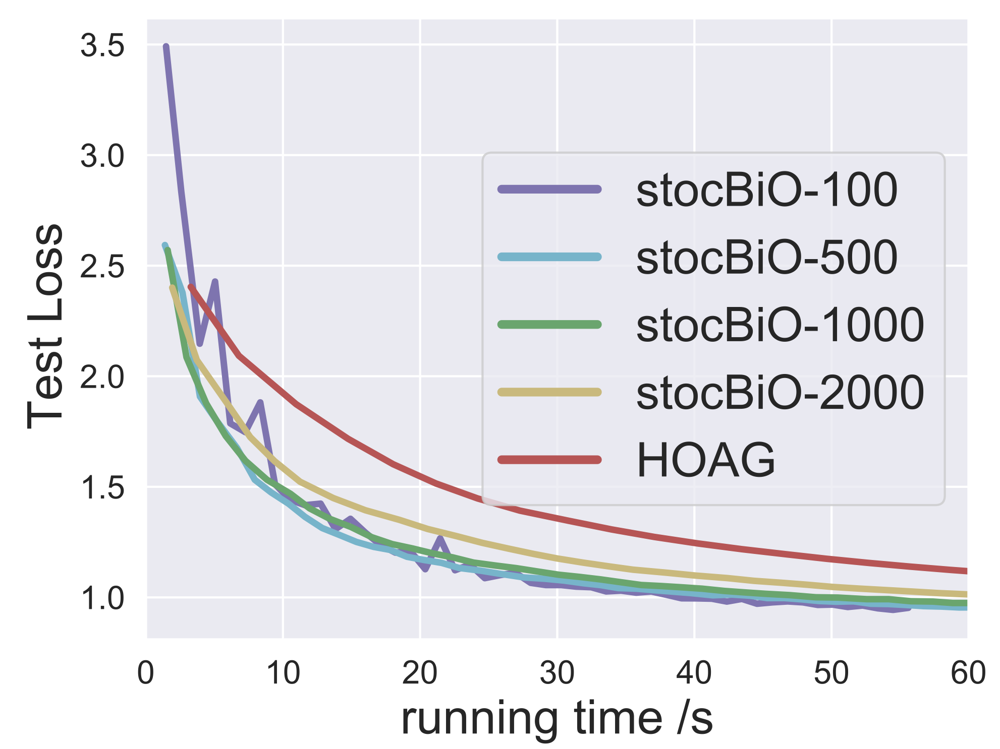

# StocBio_hp
Example hyperparameter code for paper [Bilevel Optimization: Nonasymptotic Analysis and Faster Algorithms](https://arxiv.org/pdf/2010.07962.pdf)

This repo is based on [HyperTorch](https://github.com/prolearner/hypertorch). We develop the stoc-Bio algorithm and compare it with different algorithms.

We compare our algorithm with different hyperparameter baseline algorithms

We compare the different batch size of our algorithm

